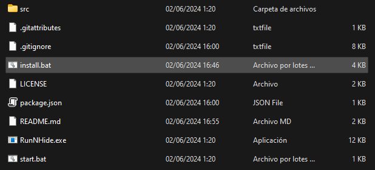

# Hugo-Utils
  

A desktop application built with Electron and Node.js, offering diverse functionalities including a computer shutdown timer, a randomizer, system cleaning and optimization tools, and more.

> ⚠️ **NOT CROSS-PLATFORM** ⚠️  
> The application is currently exclusive to Windows. Cross-platform functionality will be implemented in future updates.

<p align="center">
    
</p>

## 🛠️ Build With 
| Technology                                                            | Description                                                                                                                                                   |
|-----------------------------------------------------------------------|-----------------------------------------------------------------------------------------------------------------------------------------------------------|
| [Node.js](https://nodejs.org/en/)                                     | A runtime environment that allows JavaScript to be executed outside of a web browser, commonly used for building server-side and networking applications. |
| [Electron](https://www.electronjs.org/)                               | A framework for building cross-platform desktop applications with web technologies like JavaScript, HTML, and CSS.                                        |
| [JavaScript](https://developer.mozilla.org/en-US/docs/Web/JavaScript) | A versatile scripting language primarily used for creating dynamic content on websites.                                                                   |

## 📄 License 
This project is licensed under the [MIT](./LICENSE) license.

## 📦 How to setup
This section provides instructions on how to set up the application for optimal functionality.

### Prerequisites
---
As a prerequisite, Node.js needs to be installed. The application is built with ```Node 20.14.0 LTS``` with ```additional tools``` for proper functioning.

> ⚠️ **IMPORTANT** ⚠️  
> Installing the additional tools is crucial for ensuring the proper functioning of the application.

### Installation
---
First, you need to download the application. You can do this from the [Releases](https://github.com/HugoRamosEs/Hugo-Utils/releases)  section. Alternatively, you can download the source code from ```<> Code``` and then click on ```Download ZIP```. However, please note that this version may include features that are still in development and not yet available in the official release.

After downloading, you need to extract the .zip file and navigate into the extracted folder. Within this folder, locate a file named ```install.bat```. Run this file as an ```administrator``` and then follow the subsequent steps provided.



Once executed without any errors, the app should now be operational.
